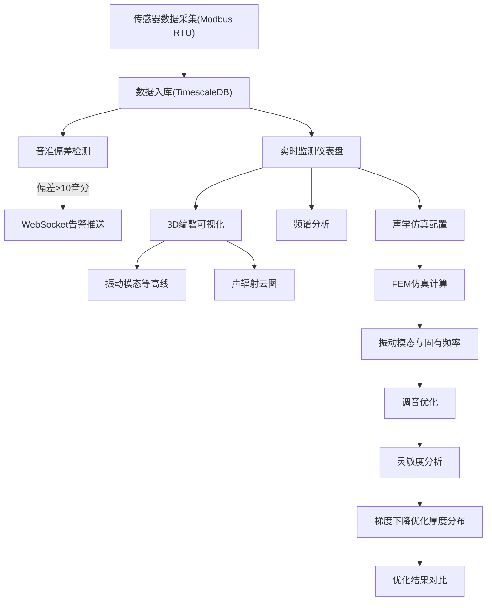

## 1. 产品概述

古代编磬声学仿真与调音优化系统——为曾侯乙编磬复原研究团队打造的专业声学仿真平台。系统基于有限元法计算磬石固有频率与振动模态，通过梯度下降优化磬石厚度分布使基频匹配目标音高，并实时监测音准偏差。

- 面向音乐考古研究团队，解决编磬复原中调音精度问题
- 集声学仿真、实时监测、调音优化、可视化分析于一体

## 2. 核心功能

### 2.1 用户角色

| 角色 | 注册方式 | 核心权限 |
|------|----------|----------|
| 研究员 | 管理员分配 | 查看仿真数据、执行调音优化、管理编磬配置 |
| 管理员 | 系统初始化 | 全部权限、系统配置、告警阈值设置 |

### 2.2 功能模块

1. **编磬三维可视化页面**: 3D编磬模型、振动模态等高线、声辐射云图、交互旋转缩放
2. **实时监测仪表盘**: 传感器数据实时展示、音准偏差告警、频谱分析图
3. **声学仿真与调音优化页面**: FEM仿真参数配置、梯度下降优化控制、优化结果对比

### 2.3 页面详情

| 页面名称 | 模块名称 | 功能描述 |
|----------|----------|----------|
| 编磬三维可视化 | 3D编磬模型 | Three.js渲染编磬石组，支持旋转/缩放/选中单枚磬石 |
| 编磬三维可视化 | 振动模态等高线 | 在3D模型表面用彩色等高线标注振动模态幅度分布 |
| 编磬三维可视化 | 声辐射云图 | Canvas绘制声辐射强度2D云图热力图 |
| 实时监测仪表盘 | 传感器数据流 | 展示Modbus RTU传感器上报的音频谱、几何尺寸、密度分布 |
| 实时监测仪表盘 | 音准偏差告警 | 偏差超过10音分触发预警，WebSocket推送红色告警 |
| 实时监测仪表盘 | 频谱分析 | 实时FFT频谱图、谐波分量柱状图 |
| 声学仿真与调音 | FEM仿真配置 | 设置网格精度、材料参数、边界条件，触发仿真计算 |
| 声学仿真与调音 | 调音优化控制 | 设置目标音高、学习率、迭代次数，执行梯度下降优化 |
| 声学仿真与调音 | 优化结果对比 | 优化前后频率对比表、厚度分布变化图、收敛曲线 |

## 3. 核心流程

用户登录系统后，可在仪表盘实时查看传感器数据与音准告警；进入3D可视化页面查看编磬模型与振动模态；在仿真调音页面配置参数并执行FEM仿真与梯度下降优化，获得最优厚度分布方案。

## 4. 用户界面设计

### 4.1 设计风格

- 主色调：深靛蓝(#1a1a2e) + 古铜金(#c9a96e) + 朱砂红(#c84b31 告警)
- 按钮风格：圆角矩形，古铜金描边，悬浮时发光效果
- 字体：Noto Serif SC（标题）+ Noto Sans SC（正文），大小层次分明
- 布局风格：左侧导航栏 + 主内容区，数据面板用卡片式布局
- 图标风格：仿古青铜纹饰风格，配合声学波形装饰

### 4.2 页面设计概览

| 页面名称 | 模块名称 | UI元素 |
|----------|----------|--------|
| 编磬三维可视化 | 3D场景 | Three.js全屏渲染、底部控制栏、右侧属性面板 |
| 编磬三维可视化 | 等高线图例 | 渐变色条（蓝→绿→黄→红）、数值标注 |
| 编磬三维可视化 | 云图面板 | Canvas热力图、色标、坐标轴标注 |
| 实时监测仪表盘 | 数据卡片 | 当前频率、偏差音分值、密度、尺寸 |
| 实时监测仪表盘 | 告警横幅 | 红色闪烁横幅、磬石编号、偏差值 |
| 实时监测仪表盘 | 频谱图 | 实时滚动波形、FFT柱状图 |
| 声学仿真与调音 | 参数表单 | 网格精度滑块、材料参数输入、边界条件下拉 |
| 声学仿真与调音 | 优化控制 | 目标音高选择、学习率/迭代次数输入、开始/暂停按钮 |
| 声学仿真与调音 | 结果面板 | 优化前后对比表、收敛曲线图、厚度分布图 |

### 4.3 响应式设计

- 桌面优先设计，最小宽度1280px
- 3D场景与Canvas固定宽高比
- 告警信息全屏宽展示

### 4.4 3D场景指引

- 环境：暗色工作室环境光，暖色调点光源模拟博物馆照明
- 灯光：主方向光 + 环境光 + 选中磬石高亮聚光灯
- 相机：透视相机，默认45°俯视角，OrbitControls交互
- 后处理：Bloom发光效果（高亮模态区域）、环境遮蔽
- 资源：程序化生成磬石几何体，无需外部模型文件

## 5. 数据模型

### 5.1 编磬石信息(bianqing_stones)

| 字段 | 类型 | 说明 |
|------|------|------|
| id | SERIAL | 主键 |
| name | VARCHAR | 磬石名称（如"上1号"） |
| target_pitch | VARCHAR | 目标音高（如"C5"） |
| target_freq | FLOAT | 目标频率(Hz) |
| length | FLOAT | 长度(mm) |
| width | FLOAT | 宽度(mm) |
| thickness_profile | JSONB | 厚度分布数组 |
| density | FLOAT | 密度(kg/m³) |
| material | VARCHAR | 材质描述 |

### 5.2 传感器数据(sensor_readings)

| 字段 | 类型 | 说明 |
|------|------|------|
| time | TIMESTAMPTZ | 时间戳 |
| stone_id | INTEGER | 磬石ID |
| frequency | FLOAT | 测量基频(Hz) |
| cents_deviation | FLOAT | 音准偏差(音分) |
| spectrum | JSONB | 频谱数据 |
| dimensions | JSONB | 几何尺寸 |
| density_map | JSONB | 密度分布 |

### 5.3 仿真结果(simulation_results)

| 字段 | 类型 | 说明 |
|------|------|------|
| id | SERIAL | 主键 |
| stone_id | INTEGER | 磬石ID |
| natural_freqs | JSONB | 固有频率数组 |
| mode_shapes | JSONB | 振动模态数据 |
| mesh_info | JSONB | 网格信息 |
| created_at | TIMESTAMPTZ | 创建时间 |

### 5.4 优化记录(optimization_records)

| 字段 | 类型 | 说明 |
|------|------|------|
| id | SERIAL | 主键 |
| stone_id | INTEGER | 磬石ID |
| target_freq | FLOAT | 目标频率 |
| initial_freq | FLOAT | 初始频率 |
| optimized_freq | FLOAT | 优化后频率 |
| thickness_before | JSONB | 优化前厚度分布 |
| thickness_after | JSONB | 优化后厚度分布 |
| iterations | INTEGER | 迭代次数 |
| convergence_history | JSONB | 收敛历史 |
| created_at | TIMESTAMPTZ | 创建时间 |

### 5.5 告警记录(alerts)

| 字段 | 类型 | 说明 |
|------|------|------|
| id | SERIAL | 主键 |
| stone_id | INTEGER | 磬石ID |
| alert_type | VARCHAR | 告警类型 |
| cents_deviation | FLOAT | 音准偏差 |
| message | TEXT | 告警消息 |
| created_at | TIMESTAMPTZ | 创建时间 |
