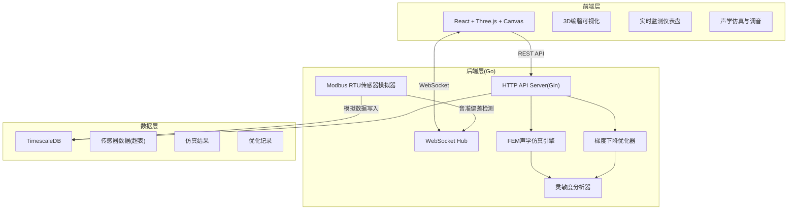
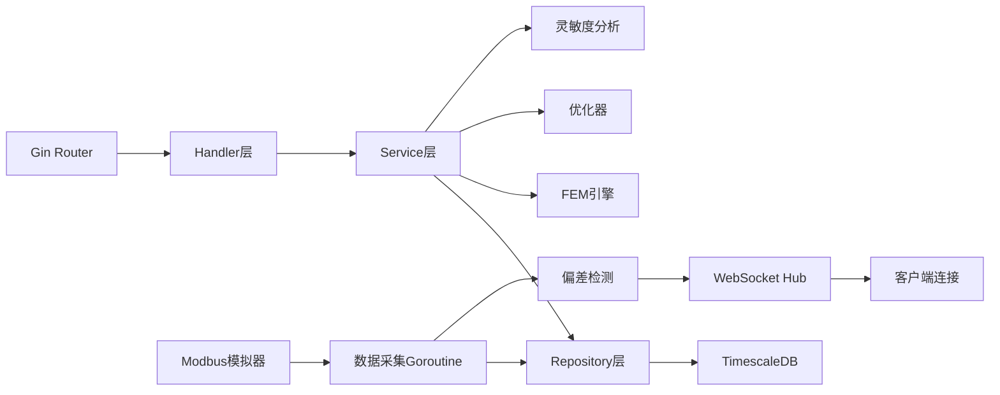
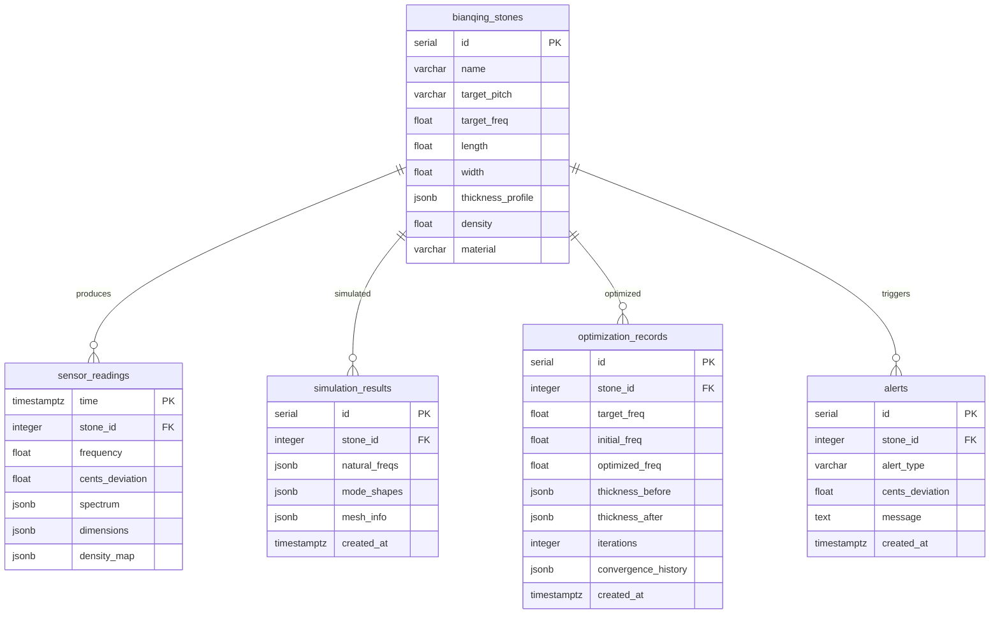

## 1. 架构设计



## 2. 技术说明

- 前端: React@18 + TypeScript + Three.js + Canvas API + TailwindCSS + Zustand + Vite
- 初始化工具: Vite
- 后端: Go 1.21 + Gin + gorilla/websocket + lib/pq
- 数据库: TimescaleDB (PostgreSQL扩展)
- 通信协议: REST API + WebSocket + 模拟Modbus RTU

## 3. 路由定义

| 路由 | 用途 |
|------|------|
| / | 主页面 - 编磬三维可视化 |
| /dashboard | 实时监测仪表盘 |
| /simulation | 声学仿真与调音优化 |

## 4. API定义

### 4.1 编磬石管理

```
GET    /api/stones           # 获取所有磬石列表
GET    /api/stones/:id       # 获取单枚磬石详情
POST   /api/stones           # 创建磬石
PUT    /api/stones/:id       # 更新磬石信息
```

### 4.2 传感器数据

```
GET    /api/sensor/latest    # 获取最新传感器数据
GET    /api/sensor/history   # 获取历史数据(分页)
GET    /api/sensor/spectrum/:stone_id  # 获取频谱数据
```

### 4.3 声学仿真

```
POST   /api/simulation/run   # 执行FEM仿真
GET    /api/simulation/results/:stone_id  # 获取仿真结果
GET    /api/simulation/modes/:stone_id    # 获取振动模态数据
```

### 4.4 调音优化

```
POST   /api/optimization/start  # 启动调音优化
GET    /api/optimization/status  # 获取优化状态
GET    /api/optimization/result/:id  # 获取优化结果
GET    /api/optimization/history/:stone_id  # 获取优化历史
```

### 4.5 告警

```
GET    /api/alerts            # 获取告警列表
GET    /api/alerts/active     # 获取活跃告警
```

### 4.6 WebSocket

```
WS     /ws                    # 实时数据推送(传感器数据、告警)
```

### 4.7 TypeScript类型定义

```typescript
interface Stone {
  id: number
  name: string
  target_pitch: string
  target_freq: number
  length: number
  width: number
  thickness_profile: number[]
  density: number
  material: string
}

interface SensorReading {
  time: string
  stone_id: number
  frequency: number
  cents_deviation: number
  spectrum: number[]
  dimensions: { length: number; width: number; thickness: number }
  density_map: number[]
}

interface SimulationResult {
  id: number
  stone_id: number
  natural_freqs: number[]
  mode_shapes: number[][][]
  mesh_info: { nodes: number; elements: number }
  created_at: string
}

interface OptimizationRecord {
  id: number
  stone_id: number
  target_freq: number
  initial_freq: number
  optimized_freq: number
  thickness_before: number[]
  thickness_after: number[]
  iterations: number
  convergence_history: number[]
  created_at: string
}

interface Alert {
  id: number
  stone_id: number
  alert_type: string
  cents_deviation: number
  message: string
  created_at: string
}

interface WSMessage {
  type: 'sensor' | 'alert' | 'optimization_progress'
  data: SensorReading | Alert | { iteration: number; freq: number; loss: number }
}
```

## 5. 服务端架构图



## 6. 数据模型

### 6.1 ER图



### 6.2 DDL语句

```sql
-- 启用TimescaleDB扩展
CREATE EXTENSION IF NOT EXISTS timescaledb;

-- 编磬石信息表
CREATE TABLE bianqing_stones (
    id SERIAL PRIMARY KEY,
    name VARCHAR(50) NOT NULL,
    target_pitch VARCHAR(10) NOT NULL,
    target_freq FLOAT NOT NULL,
    length FLOAT NOT NULL,
    width FLOAT NOT NULL,
    thickness_profile JSONB NOT NULL,
    density FLOAT NOT NULL DEFAULT 2650.0,
    material VARCHAR(100) DEFAULT '石灰岩',
    created_at TIMESTAMPTZ DEFAULT NOW(),
    updated_at TIMESTAMPTZ DEFAULT NOW()
);

-- 传感器数据超表
CREATE TABLE sensor_readings (
    time TIMESTAMPTZ NOT NULL,
    stone_id INTEGER REFERENCES bianqing_stones(id),
    frequency FLOAT NOT NULL,
    cents_deviation FLOAT NOT NULL,
    spectrum JSONB,
    dimensions JSONB,
    density_map JSONB
);

SELECT create_hypertable('sensor_readings', 'time');

-- 仿真结果表
CREATE TABLE simulation_results (
    id SERIAL PRIMARY KEY,
    stone_id INTEGER REFERENCES bianqing_stones(id),
    natural_freqs JSONB NOT NULL,
    mode_shapes JSONB NOT NULL,
    mesh_info JSONB,
    created_at TIMESTAMPTZ DEFAULT NOW()
);

-- 优化记录表
CREATE TABLE optimization_records (
    id SERIAL PRIMARY KEY,
    stone_id INTEGER REFERENCES bianqing_stones(id),
    target_freq FLOAT NOT NULL,
    initial_freq FLOAT NOT NULL,
    optimized_freq FLOAT NOT NULL,
    thickness_before JSONB NOT NULL,
    thickness_after JSONB NOT NULL,
    iterations INTEGER NOT NULL,
    convergence_history JSONB,
    created_at TIMESTAMPTZ DEFAULT NOW()
);

-- 告警记录表
CREATE TABLE alerts (
    id SERIAL PRIMARY KEY,
    stone_id INTEGER REFERENCES bianqing_stones(id),
    alert_type VARCHAR(50) NOT NULL DEFAULT 'pitch_deviation',
    cents_deviation FLOAT NOT NULL,
    message TEXT NOT NULL,
    created_at TIMESTAMPTZ DEFAULT NOW()
);

-- 索引
CREATE INDEX idx_sensor_stone ON sensor_readings (stone_id, time DESC);
CREATE INDEX idx_simulation_stone ON simulation_results (stone_id);
CREATE INDEX idx_optimization_stone ON optimization_records (stone_id);
CREATE INDEX idx_alerts_stone ON alerts (stone_id, created_at DESC);
CREATE INDEX idx_alerts_active ON alerts (created_at DESC) WHERE alert_type = 'pitch_deviation';

-- 连续聚合：每5分钟平均频率
CREATE MATERIALIZED VIEW sensor_5min_avg
WITH (timescaledb.continuous) AS
SELECT
    time_bucket('5 minutes', time) AS bucket,
    stone_id,
    AVG(frequency) AS avg_freq,
    AVG(cents_deviation) AS avg_deviation,
    COUNT(*) AS reading_count
FROM sensor_readings
GROUP BY bucket, stone_id;

-- 刷新策略
SELECT add_continuous_aggregate_policy('sensor_5min_avg',
    start_offset => INTERVAL '1 hour',
    end_offset => INTERVAL '5 minutes',
    schedule_interval => INTERVAL '5 minutes');

-- 数据保留策略：保留90天原始数据
SELECT add_retention_policy('sensor_readings', INTERVAL '90 days');
```

## 7. FEM声学仿真模型设计

### 7.1 磬石有限元模型

磬石建模为薄板结构，采用四边形壳单元离散化。基于Kirchhoff薄板理论：

**刚度矩阵**: K = ∫∫ BᵀDB dA
**质量矩阵**: M = ∫∫ NᵀρhN dA
**特征值问题**: (K - ω²M)φ = 0

其中：
- B: 应变-位移矩阵
- D: 弹性刚度矩阵 (D = Eh³/12(1-ν²))
- N: 形函数矩阵
- ρ: 密度
- h: 厚度
- ω: 固有角频率
- φ: 振型向量

### 7.2 材料参数

- 弹性模量 E = 70 GPa (石灰岩)
- 泊松比 ν = 0.25
- 密度 ρ = 2650 kg/m³

### 7.3 网格划分

- 采用结构化四边形网格
- 默认网格密度: 20×10 (长×宽)
- 支持自定义网格密度

## 8. 调音优化模型设计

### 8.1 灵敏度分析

基频对厚度的灵敏度: ∂f/∂hᵢ = -3f/(2hᵢ) (薄板近似)

### 8.2 梯度下降优化

目标函数: L(f, f_target) = (f - f_target)²

更新规则: hᵢ⁺¹ = hᵢ - α · ∂L/∂hᵢ

其中 α 为学习率，约束条件：h_min ≤ hᵢ ≤ h_max

### 8.3 收敛判据

|f - f_target| < 1 Hz 或达到最大迭代次数
